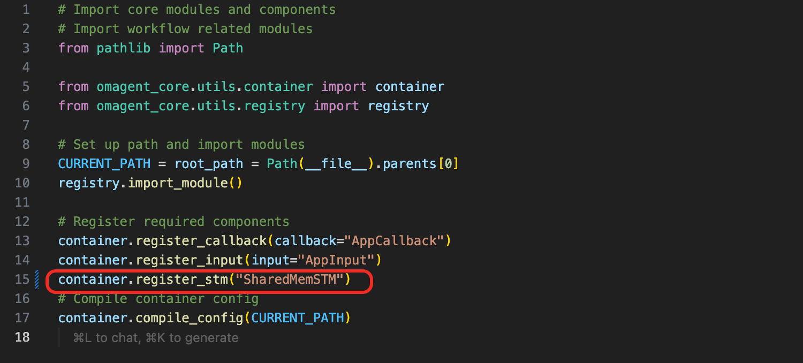
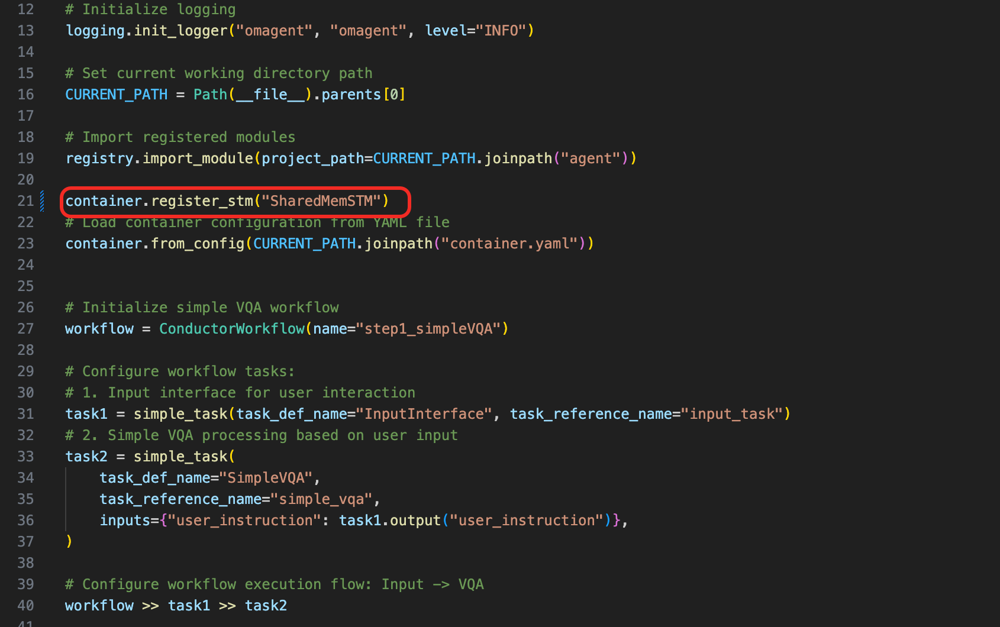

# Introduction to the new STM: SharedMemSTM

## Overview

In the latest release of OmAgent v0.2.1, a new Short-term Memory (STM) module called SharedMemSTM has been introduced. Previously, OmAgent relied on RedisSTM, which stored data in a Redis database. While effective, RedisSTM required setting up a Redis server and managing connection details. SharedMemSTM, on the other hand, is an in-memory STM solution that eliminates the need for external storage, offering a more convenient and streamlined approach.

## What is SharedMemSTM?

SharedMemSTM is a module that leverages the `shared_memory` feature in Python's multiprocessing library to store data between workers in a workflow. This approach allows for efficient data sharing without the overhead of external databases. By utilizing shared memory, SharedMemSTM provides a lightweight and fast solution for managing short-term data, making it ideal for dynamic and resource-constrained environments. This innovation simplifies the setup process and enhances the performance of workflows by reducing latency and complexity. 

## Key Features

*   **Easy to Set Up and Use**: SharedMemSTM requires no additional storage setup, making it straightforward to integrate into existing workflows. This simplicity reduces configuration overhead and accelerates deployment.
    
*   **High Performance**: By using in-memory data storage, SharedMemSTM minimizes latency and maximizes data access speed, ensuring efficient data handling in real-time applications.
    
*   **Thread Safety**: Designed with concurrency in mind, SharedMemSTM ensures that data integrity is maintained even when multiple threads access shared memory simultaneously.
    
*   **Integration with OmAgent**: Seamless integration with the existing OmAgent framework, allowing for easy adoption and minimal changes to existing codebases.
    

## Use Cases

*   **Real-Time Data Sharing**: Enable real-time sharing of data between multiple agents, such as sensor readings, status updates, or intermediate results.
    
*   **Collaborative Decision-Making**: Facilitate collaborative decision-making processes where multiple workers need to access and update a shared state.
    
*   **State Synchronization**: Ensure that all workers have a consistent view of the current state, which is particularly useful in complex workflow.
    
*   **Caching and Lookup**: Use SharedMemSTM as a fast in-memory cache to store frequently accessed data, reducing the need for expensive database queries.
    

## Getting Started

To get started with **SharedMemSTM**, follow these steps:

1.  **Installation**:
    
    *   Ensure you have the latest version of the OmAgent installed.
        
2.  **Configuration**:
    
    *   When compile your container.yaml, register SharedMemSTM as STM
        



3.  **Usage**:
    
    *   Register SharedMemSTM as the default STM for your workflow.




*   Then you can easily use SharedMemSTM inside your worker by: 
    

```plaintext
self.stm(self.workflow_instance_id)[key] = value
```

## Important to Notice

*   **Data Storage Format**: SharedMemSTM stores data in a key-value format, where values are serialized before being stored. This means you cannot directly update the contents of a value. For example, operations like `self.stm(self.workflow_instance_id)["image_cache"]["image0"] = pil_image` are not supported. Instead, you need to retrieve the value from STM, update it, and then save it back. For instance:
    

```python
image_cache = self.stm(self.workflow_instance_id)["image_cache"]
image_cache["image0"] = pil_image
self.stm(self.workflow_instance_id)["image_cache"] = image_cache
```

*   **In-Memory Limitation:** Since SharedMemSTM operates in-memory, it cannot be shared across multiple services. For distributed needs, it's recommended to use RedisSTM.